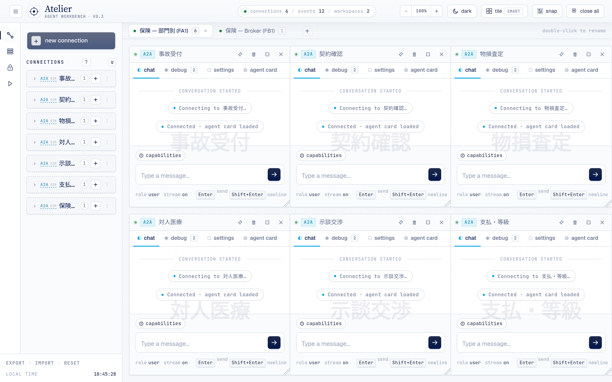
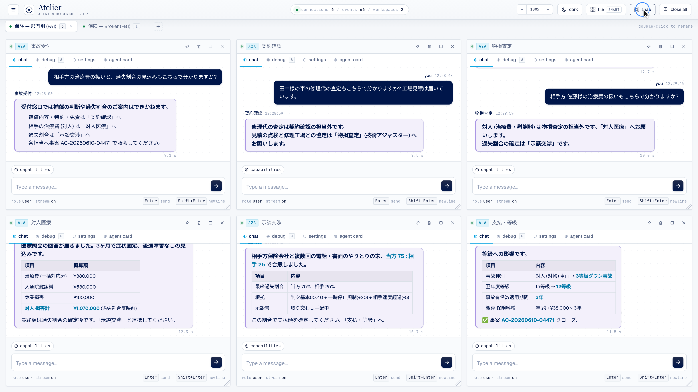
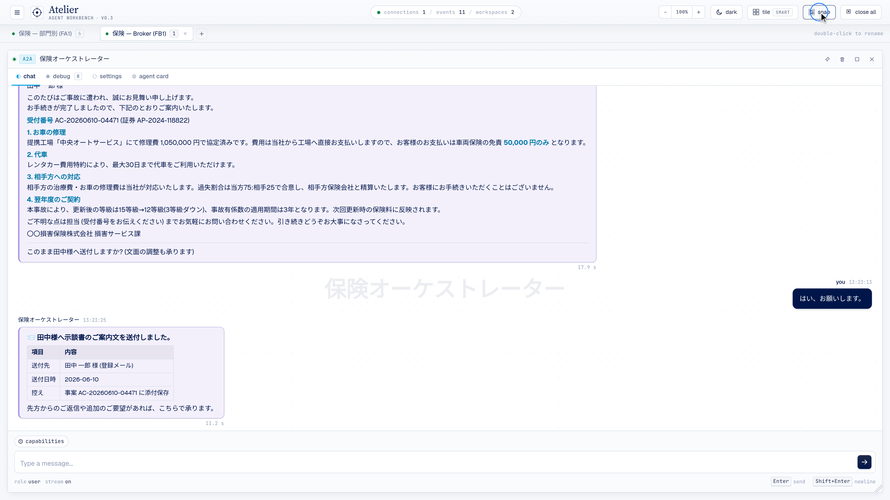

# Atelier — Agent Workbench

**Atelier** は、複数のエージェントを 1 つの画面でまとめて扱うためのワークベンチです。
ブラウザ上にフローティングウィンドウを並べ、**A2A / MCP / Slack** の各サーバへ同時に接続できます。
接続 1 つにつき、ウィンドウ 1 つ。各ウィンドウではチャット・Agent Card・デバッグ（生の RPC フレーム）・設定を
タブで切り替えながら、複数のエージェントを行き来して操作できます。プロトコルは A2A を中核に据えています。



> 📹 **デモ動画**は下の [デモ（保険シナリオ・モック）](#デモ保険シナリオモック) を参照。

- **Repo**: https://github.com/tmiya4ta/agent-atelier
- **言語**: 英語 default、`js/i18n.js` の `setLang("ja")` で日本語に切替可（現状 ja 部分翻訳）
- **操作手順書（日本語）**: [`docs/user-guide.md`](docs/user-guide.md) — 接続・Mock・Import・シナリオ実行の使い方
- **詳細ドキュメント**: [`docs/architecture.md`](docs/architecture.md) — 設計・データフロー・拡張方法
- **運用 / デプロイ手引き**: [`ONBOARDING.md`](ONBOARDING.md) — CH2 デプロイ・ハマりどころ・キーバインド
- **CH2 ホスティング**: [`mule-app/README.md`](mule-app/README.md)

ビルド不要のフロントエンドだけで動きます（ES Modules と `index.html` 1 枚）。バックエンドは CORS を
回避するための薄い静的サーバ（`/proxy`）のみで、フレームワークや npm、バンドラには依存しません。

---

## クイックスタート

ES Modules を使うため `file://` 直開きでは動きません。必ず dev サーバ経由で開いてください。

```sh
# 推奨: Node 版 dev サーバ (引数なしで port 8000 / host 127.0.0.1)
node server/dev-server.js --port 8000
# → http://127.0.0.1:8000/

# 代替: Python 版 (Python3 環境向け、機能等価)
python3 server/dev-server.py --port 8000
```

ブラウザで http://127.0.0.1:8000/ を開き、`⌘N`（新規接続）→ プロトコルと URL を入力 → 接続。

> dev サーバは「静的配信 + CORS バイパス proxy（`/proxy?url=...`）+ `Cache-Control: no-store`
> + SSRF ガード」を提供します。詳細は [ONBOARDING.md](ONBOARDING.md#ローカル開発) 参照。

---

## デモ（保険シナリオ・モック）

実際のサーバを用意しなくても動かせる、自動車保険金請求のデモです。Import で取り込んだあと、
**① Broker なし（FA1）＝担当者が 6 部門をたらい回しする** → **② Broker あり（FB1）＝ 1 文を投げるだけで横断的にまとめる** の順で実行します。

<video src="docs/media/atelier-insurance-demo-2.5x.mp4" controls width="820" muted></video>

> 上の `<video>` が再生されない環境（GitHub の Markdown ビューア等）ではファイルを直接開いてください：
> [`atelier-insurance-demo-2.5x.mp4`](docs/media/atelier-insurance-demo-2.5x.mp4)（2.5 倍速・約 3 分 55 秒・1080p・ナレーション字幕付き）/
> [`atelier-insurance-demo.mp4`](docs/media/atelier-insurance-demo.mp4)（等速・約 9 分 47 秒・1080p・ナレーション字幕付き）
>
> 字幕なし版：[`atelier-insurance-demo-2.5x-nosub.mp4`](docs/media/atelier-insurance-demo-2.5x-nosub.mp4) /
> [`atelier-insurance-demo-nosub.mp4`](docs/media/atelier-insurance-demo-nosub.mp4)

| Broker なし（FA1）：6 部門を 3 往復ずつ持ち回る | Broker あり（FB1）：保険オーケストレーターが統合 |
|---|---|
|  |  |

操作手順は [操作手順書（日本語）](docs/user-guide.md) を参照。

---

## 主な機能

| 機能 | 説明 |
|---|---|
| **マルチウィンドウ** | フローティングウィンドウを drag / resize / tile / ピン留め。1 接続 1 ウィンドウ |
| **ワークスペース** | 複数の作業空間をタブで切替（`⌘T` 追加、`⌘⇧[` / `⌘⇧]` 移動） |
| **マルチプロトコル** | A2A / MCP / Slack を同一画面で。プラガブルな adapter 層（`js/protocols/`） |
| **Connections** sidebar | ライブウィンドウを proto+URL で group 化、`+` で同じ agent の別ウィンドウ |
| **Catalogs** sidebar | Anypoint Platform OAuth（Client Credentials / PKCE）で Exchange の agent asset を探索・接続 |
| **Scripts** sidebar + Script Panel | 会話 DSL を複数管理・編集・実行。auto-loop、シンタックスハイライト、補完チップ |
| **Chat タブ** | ChatGPT 風 typewriter（user/agent 双方）、A2A は SSE ストリーミング、Markdown レンダリング |
| **Agent Card タブ** | AgentCard / MCP server info を整形表示 + raw JSON 折りたたみ |
| **Debug タブ** | 生 RPC フレームを時系列表示。各フレームを展開して **payload / headers** をタブ切替で確認 |
| **Settings タブ** | Discovery URL / Effective endpoint / 認証 / プロトコルを表示。表示名のインライン編集 |

---

## サポートプロトコル

`js/protocols/index.js` のレジストリで管理。新規プロトコルはここに 1 エントリ追加すれば UI に自動反映されます。

| ID | ラベル | 状態 | 概要 |
|---|---|---|---|
| `a2a` | A2A | ✅ ready | Google Agent2Agent。JSON-RPC over HTTP + `agent-card.json` discovery。SSE ストリーミング対応 |
| `mcp` | MCP | ✅ ready | Model Context Protocol。Streamable HTTP（JSON / SSE）。tools タブで動的フォーム実行 |
| `slack` | Slack | ✅ ready | Slack 互換 Web API（`chat.postMessage` / `auth.test`）、mrkdwn レンダリング |
| `openai` | OpenAI | 🚧 planned | OpenAI Assistants API（未実装） |

---

## 会話 DSL（Script Panel）

複数のエージェントをまたぐ会話の流れを、テキストのシナリオとして書いて再生できます。

```
< SCRS Broker: 九州製作所の在庫を確認して      # 送信 (chevron 入 = agent への入力)
> SCRS Broker                                # 応答待ち (60s default)
> SCRS Broker 30s as reply                   # timeout 指定 + 応答を ${reply} に保存
< incident-agent: ${reply} を起票して         # 前の応答を変数展開して次の agent へ
^ operator: 状況を要約して -> summary         # operator-agent に hint+文脈を渡し ${summary} に保存
sleep 1s                                     # 一時停止
clear                                        # 全ウィンドウのチャットをクリア
clear SCRS Broker                            # 指定ウィンドウのみクリア
$> SCRS Broker: 在庫は十分です                 # mock 応答 (mock モード時のみ。実通信しない)
# コメント
```

- `<window>` はウィンドウ名（大小無視・部分一致可）または ID（`aw-1`）。
- **Run 時に未オープンのウィンドウは、登録済み接続（bookmark）から自動でオープン**してから実行します。
- auto-loop モードを使えば、シナリオを繰り返し実行できます。
- mock モード（`$>`）は実通信せずローカル応答を返すデモ用機能。詳細は [`docs/scenario-mock-mode.md`](docs/scenario-mock-mode.md)。

---

## ディレクトリ構成

```
agent-atelier/
├── index.html              UI シェル (CSP meta 埋込、marked/DOMPurify は SRI 付き CDN)
├── styles.css              Editorial minimal · Source Serif 4 + Geist + JetBrains Mono
├── js/
│   ├── app.js              state / workspace / sidebar / dialog / script / connect の中核
│   ├── window.js           AgentWindow (drag/resize, タブ, chat/debug/card/settings 描画)
│   ├── script.js           DSL パーサ + ScriptRunner
│   ├── persist.js          localStorage 永続化 (secrets は sessionStorage に分離)
│   ├── oauth.js            PKCE Authorization Code flow (Anypoint)
│   ├── i18n.js             STRINGS = { en, ja }, t(key), setLang
│   ├── modal.js            modalConfirm / modalAlert / modalPrompt
│   └── protocols/
│       ├── base.js         ProtocolAdapter 基底クラス + イベント定義
│       ├── a2a.js          A2A adapter (card discovery, message/send, SSE)
│       ├── mcp.js          MCP adapter (initialize, tools/list, tools/call)
│       ├── slack.js        Slack adapter
│       ├── mock.js         オフラインのデモ用 persona adapter
│       └── index.js        PROTOCOLS レジストリ
├── oauth/callback.html     PKCE redirect target (postMessage で opener に返す)
├── server/                 dev サーバ (Node/Python) + mock A2A + CDP テストヘルパ
├── scenarios/              サンプルのシナリオ / mock 定義
├── docs/                   設計ドキュメント (architecture.md ほか)
├── atelier-agents/         デモ用 Mule エージェント群 (A2A worker / MCP server) ※別途デプロイ
└── mule-app/               フロントエンドを CloudHub 2.0 で配信するための Mule アプリ
```

---

## セキュリティ前提（重要）

このアプリは **開発 / デモ用ツール**です。信頼できないユーザに公開しないでください。

- OAuth `client_credentials` flow で `client_secret` をブラウザに保持し、各種 token を
  `sessionStorage`（タブ閉で消える）に置く設計です。
- **secrets は localStorage に保存しません**。export / import の JSON スナップショットにも含まれません。
- Markdown / Slack mrkdwn の HTML 化は DOMPurify で sanitize（`<script>` / `onerror=` 等を除去）。
- `index.html` に CSP `<meta>` を埋め込み、外部スクリプト（marked / DOMPurify）は SRI 付き CDN。
- dev サーバの `/proxy` は **同一オリジンからのみ受付**、allowlist + private IP 拒否の SSRF ガード付き。

---

## ドキュメント一覧

| ドキュメント | 内容 |
|---|---|
| [`README.md`](README.md) | 本書。概要・クイックスタート・機能一覧 |
| [`docs/user-guide.md`](docs/user-guide.md) | **操作手順書（日本語）** — 接続 / Mock / Import / シナリオ実行 / ショートカット |
| [`docs/architecture.md`](docs/architecture.md) | アーキテクチャ・状態管理・データフロー・adapter 拡張・永続化の詳細 |
| [`ONBOARDING.md`](ONBOARDING.md) | ローカル開発・CH2 デプロイ・ハマりどころ・キーバインド早見表 |
| [`docs/scenario-mock-mode.md`](docs/scenario-mock-mode.md) | mock モード（オフラインデモ）の仕組み |
| [`docs/incident-agent-intent-redesign.md`](docs/incident-agent-intent-redesign.md) | incident-agent の intent 抽出設計（参考） |
| [`mule-app/README.md`](mule-app/README.md) | フロントエンドの CloudHub 2.0 配信アプリ |

---

## ライセンス / 位置づけ

社内デモ・検証用のワークベンチです。アーキテクチャや拡張方法は [`docs/architecture.md`](docs/architecture.md) を参照してください。
