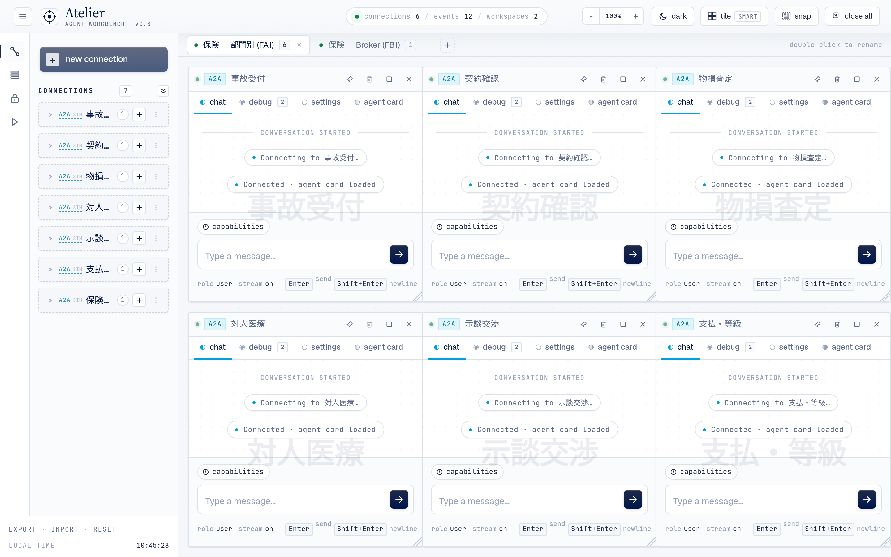
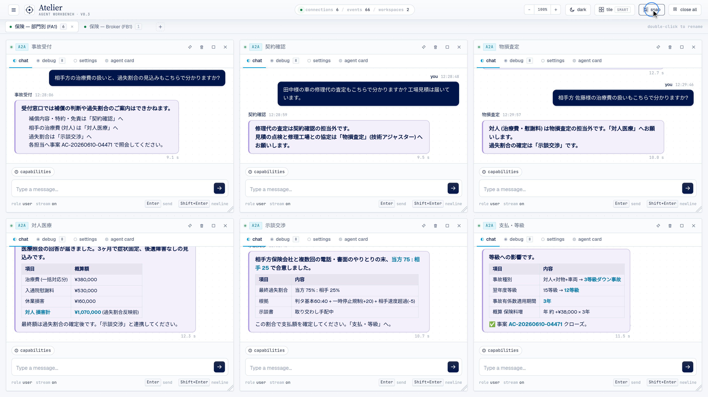
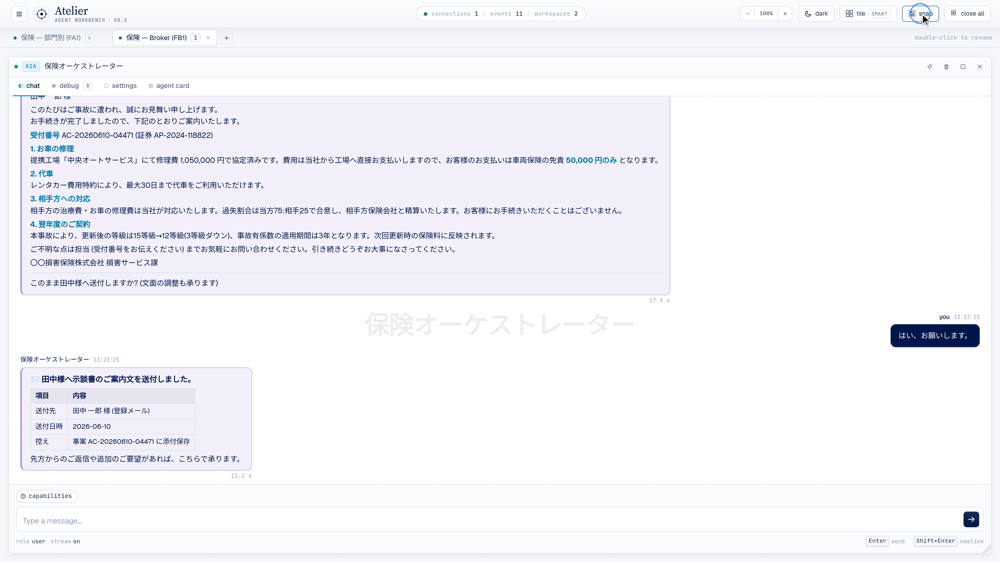
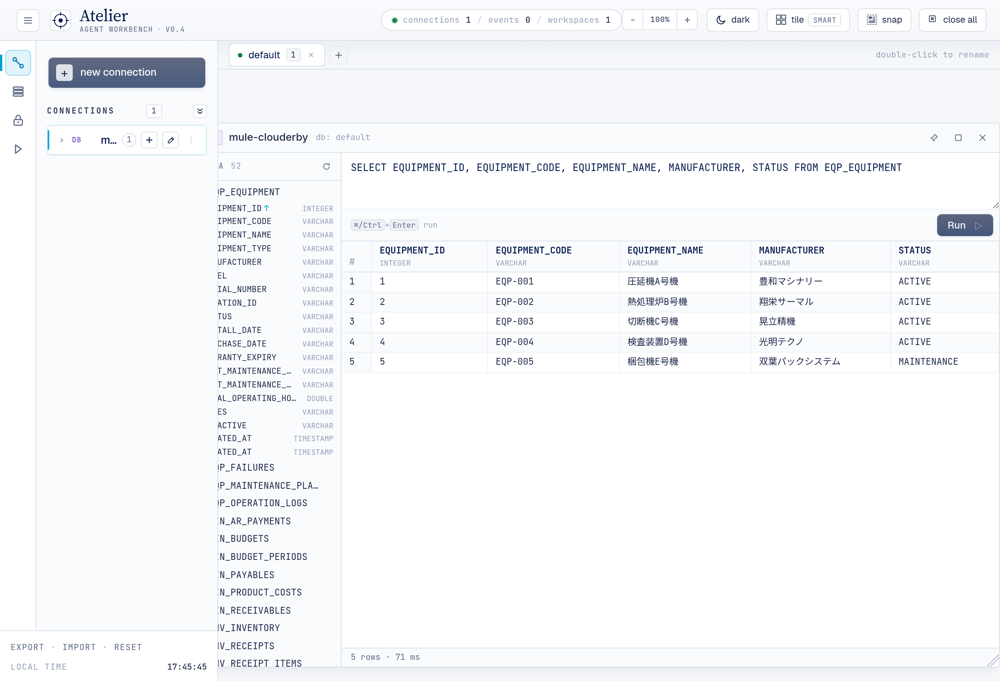
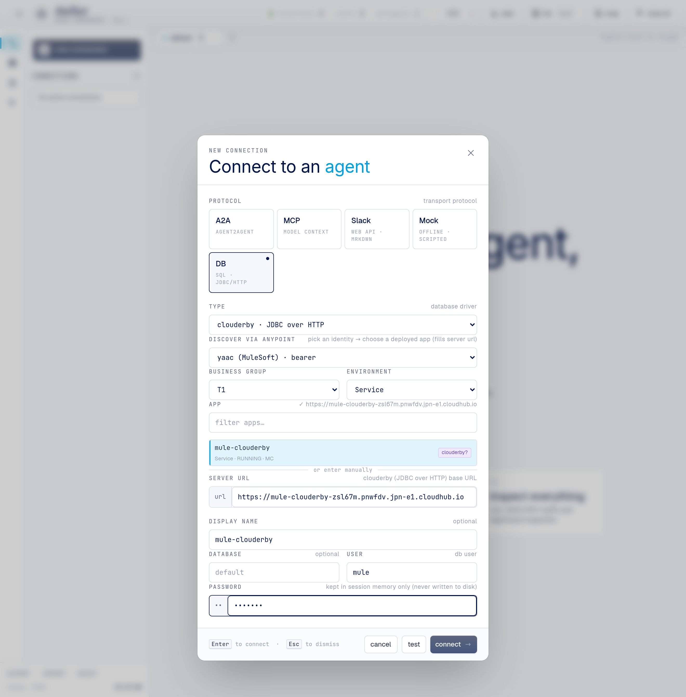

# Atelier — Agent Workbench

**Atelier** は、複数のエージェントを 1 つの画面でまとめて扱うためのワークベンチです。
ブラウザ上にフローティングウィンドウを並べ、**REST / A2A / MCP** の各サーバへ同時に接続できます。
さらに **SQL データベース（clouderby = JDBC over HTTP）** にも接続でき、SQL エディタ + 結果グリッド +
スキーマツリーの **DB ワークベンチ**として使えます。
接続 1 つにつき、ウィンドウ 1 つ。エージェントウィンドウではチャット・Agent Card・デバッグ（生の RPC
フレーム）・設定をタブで切り替えながら操作でき、DB ウィンドウでは SQL を実行して結果を表で確認できます。
プロトコルは A2A を中核に据えています。



> 📹 **デモ動画**は下の [デモ（保険シナリオ・モック）](#デモ保険シナリオモック) を参照。

- **Repo**: https://github.com/tmiya4ta/agent-atelier
- **言語**: 英語 default、`ui/js/i18n.js` の `setLang("ja")` で日本語に切替可（現状 ja 部分翻訳）
- **操作手順書（日本語）**: [`docs/user-guide.md`](docs/user-guide.md) — 接続・Mock・Import・シナリオ実行の使い方
- **詳細ドキュメント**: [`docs/architecture.md`](docs/architecture.md) — 設計・データフロー・拡張方法
- **運用 / デプロイ手引き**: [`ONBOARDING.md`](ONBOARDING.md) — CH2 デプロイ・ハマりどころ・キーバインド
- **CH2 ホスティング**: [`mule-app/README.md`](mule-app/README.md)

ビルド不要のフロントエンドだけで動きます（ES Modules と `ui/index.html` 1 枚）。バックエンドは CORS を
回避するための薄い静的サーバ（`/proxy`）のみで、フレームワークや npm、バンドラには依存しません。

---

## クイックスタート

ES Modules を使うため `file://` 直開きでは動きません。必ず dev サーバ経由で開いてください。

```sh
# 推奨: Node 版 dev サーバ (引数なしで port 8000 / host 127.0.0.1)
node server/dev-server.js --port 8000
# → http://127.0.0.1:8000/

# 代替: Python 版 (Python3 環境向け、機能等価)
python3 server/dev-server.py --port 8000
```

ブラウザで http://127.0.0.1:8000/ を開き、左サイドバーの **+ new connection** → プロトコルと URL を
入力 → 接続。

> dev サーバは「静的配信 + CORS バイパス proxy（`/proxy?url=...`）+ `Cache-Control: no-store`
> + SSRF ガード」を提供します。詳細は [ONBOARDING.md](ONBOARDING.md#ローカル開発) 参照。

---

## デモ（保険シナリオ・モック）

実際のサーバを用意しなくても動かせる、自動車保険金請求のデモです。**Import → Repository** から
「保険 — 自動車保険金請求」を取り込んだあと、
**① Broker なし（FA1）＝担当者が 6 部門をたらい回しする** → **② Broker あり（FB1）＝ 1 文を投げるだけで横断的にまとめる** の順で実行します。

<video src="docs/media/atelier-insurance-demo-2.5x.mp4" controls width="820" muted></video>

> 上の `<video>` が再生されない環境（GitHub の Markdown ビューア等）ではファイルを直接開いてください：
> [`atelier-insurance-demo-2.5x.mp4`](docs/media/atelier-insurance-demo-2.5x.mp4)（2.5 倍速・約 3 分 55 秒・1080p・ナレーション字幕付き）/
> [`atelier-insurance-demo.mp4`](docs/media/atelier-insurance-demo.mp4)（等速・約 9 分 47 秒・1080p・ナレーション字幕付き）
>
> 字幕なし版：[`atelier-insurance-demo-2.5x-nosub.mp4`](docs/media/atelier-insurance-demo-2.5x-nosub.mp4) /
> [`atelier-insurance-demo-nosub.mp4`](docs/media/atelier-insurance-demo-nosub.mp4)

| Broker なし（FA1）：6 部門を 3 往復ずつ持ち回る | Broker あり（FB1）：保険オーケストレーターが統合 |
|---|---|
|  |  |

操作手順は [操作手順書（日本語）](docs/user-guide.md) を参照。

---

## 主な機能

| 機能 | 説明 |
|---|---|
| **マルチウィンドウ** | フローティングウィンドウを drag / resize / tile / ピン留め。1 接続 1 ウィンドウ |
| **ワークスペース** | 複数の作業空間をタブで切替（`⌘⇧[` / `⌘⇧]`）。タブは drag & drop で並べ替え可 |
| **マルチプロトコル** | REST / A2A / MCP / DB / Mock を同一画面で。プラガブルな adapter 層（`ui/js/protocols/`） |
| **A2A への MCP 受け渡し** | A2A ウィンドウに MCP サーバを登録すると、そのツール一覧を送信時に相手エージェントへ渡す。**どれを使うか判断して実行するのは相手側**（下記参照） |
| **DB ワークベンチ** | clouderby（JDBC over HTTP）に接続。スキーマツリー + SQL エディタ + 結果グリッド。Anypoint からデプロイ済みアプリを選んで URL 自動入力（Anypoint UI 不要）。`test` で接続確認 |
| **Import / Export** | 設定一式のスナップショットを取り込み / 書き出し。Repository（同梱シナリオ）/ URL / ローカルファイルの 3 経路。Export は保存先をファイルピッカーで選択可（対応ブラウザ） |
| **Connections** sidebar | ライブウィンドウを proto+URL で group 化、`+` で同じ agent の別ウィンドウ。drag & drop で並べ替え可 |
| **Catalogs** sidebar | Anypoint Platform OAuth（Client Credentials / PKCE）で Exchange の agent asset を探索・接続 |
| **Scenarios** sidebar + Script Panel | 会話 DSL を複数管理・編集・実行。auto-loop、シンタックスハイライト、補完チップ |
| **Chat タブ** | ChatGPT 風 typewriter（user/agent 双方）、A2A は SSE ストリーミング、Markdown レンダリング |
| **Agent Card タブ** | AgentCard / MCP server info を整形表示 + raw JSON 折りたたみ。**reload** で再取得 |
| **capabilities オーバーレイ** | chat から相手の AgentCard を要約表示（transport / capabilities の on-off / i/o / skills / 登録済み MCP）。**reload** で再取得 |
| **Debug タブ** | 生 RPC フレームを時系列表示。各フレームを展開して **payload / headers** をタブ切替で確認 |
| **Settings タブ** | Discovery URL / Effective endpoint / 認証 / プロトコルを表示。表示名のインライン編集 |

左サイドバーは connections / catalogs / scenarios / authentication / platform / tools の 6 セクションです。

---

## サポートプロトコル

`ui/js/protocols/index.js` のレジストリで管理。新規プロトコルはここに 1 エントリ追加すれば UI に自動反映されます。

表示順は REST / A2A / MCP / DB / Mock。

| ID | ラベル | 状態 | 概要 |
|---|---|---|---|
| `rest` | REST | ✅ ready | 汎用 HTTP クライアント。メソッド / パス / ヘッダ / ボディを直接組み立てて送る raw リクエスト。JSON は色付き表示 |
| `a2a` | A2A | ✅ ready | Google Agent2Agent。JSON-RPC over HTTP + `agent-card.json` discovery。SSE ストリーミング対応。A2A 0.3（legacy）と A2A 1.0（proto スキーマ）を自動判別 |
| `mcp` | MCP | ✅ ready | Model Context Protocol。Streamable HTTP（JSON / SSE）。tools タブで動的フォーム実行 |
| `db` | DB | ✅ ready | SQL データベースクライアント。clouderby（JDBC over HTTP）ドライバ。SQL エディタ + 結果グリッド + スキーマツリー。Anypoint アプリ探索で URL 自動入力 |
| `mock` | Mock | ✅ ready | オフラインのデモ用 persona。実通信せず台本（Script Panel）を再生 |

---

## A2A エージェントに MCP ツールを渡す

A2A ウィンドウの chat ツールバーにある **`+ mcp`** から MCP サーバを登録できます。登録済みの接続から
選ぶか、その場で新規作成できます。送信時、Atelier は登録された各サーバへ `tools/list` して、その一覧を
A2A メッセージの data part に載せて相手エージェントへ渡します。

**ツールを呼ぶのは相手のエージェントです。** Atelier は一覧を渡すだけで、どれを使うかの判断も
`tools/call` の実行も相手側が行います。そのため MCP サーバに認証が要る場合は、その資格情報も
相手エージェントへ渡ります（[セキュリティ前提](#セキュリティ前提重要)参照）。

登録済みのサーバは `+ mcp` のポップオーバーで一覧・削除でき、capabilities オーバーレイにも表示されます。

参照実装として `server/` に 2 つのエージェントを同梱しています（いずれも A2A サーバ）:

| ファイル | 判断方法 |
|---|---|
| `server/gemini-agent.js` | Gemini の function calling でツールを選択・実行。会話履歴を contextId 単位で保持 |
| `server/mcp-agent.js` | ルールベース（LLM 不要）。動作確認用 |

### AgentCard の skill examples

AgentCard の `skills[].examples`（A2A の任意フィールド）を宣言していれば、capabilities に例文が並び、
その 1 つが chat 入力欄に薄く表示されます。**Tab** で確定でき、押すたびに次の例に切り替わります。
宣言していないエージェントでは何も表示されません。

---

## シナリオの取り込み（Import → Repository）

`scenarios/` に置いた スナップショットを、アプリ内の **Import → Repository** から選んで取り込めます。
UI は GitHub raw を直接読むため、**push した時点で反映されます（再デプロイ不要）**。

| ファイル | 用途 |
|---|---|
| `scenarios/*.json` | 配布するスナップショット本体 |
| `scenarios/index.json` | 一覧。**手で書かず CI が自動生成** |
| `tools/gen-scenarios-index.mjs` | 生成スクリプト（`--check` で差分検査のみ） |
| `.github/workflows/scenarios-index.yml` | `scenarios/` の追加・更新・削除で index を再生成して commit |

各スナップショットは任意で `meta` を持てます。無ければファイル名と中身の件数から自動生成されます。

```json
{ "meta": { "name": "表示名", "description": "説明", "order": 10 }, "state": { … } }
```

> 再 export したファイルで上書きすると `meta` が落ちます（export には含まれないため）。
> 差し替えるときは先頭の `meta` ブロックを残してください。

取り込みの範囲は 1 つのダイアログで選びます。**Scenarios only**（既定）は会話 DSL だけを
現在の設定にマージし、外すと接続・ワークスペースを含めて全置換します。会話 DSL を含まない
スナップショットを Scenarios only で選んだ場合は、全置換になる旨を確認してから進みます。

`ui/scenarios/` にも同じ一覧があり、こちらは GitHub raw が読めないとき（オフライン等）の
フォールバックとして同一オリジンから配信されます。通常読まれるのは root の `scenarios/` です。

---

## DB ワークベンチ（clouderby）

`DB` コネクションは [clouderby](https://github.com/tmiya4ta/mule-clouderby)（JDBC over HTTP プロトコル）の
サーバに接続し、ブラウザ上で SQL を実行できます。CORS が無いため `/proxy` 経由でアクセスし、`X-Clouderby-Session-Id`
でセッションを引き回します。



- **スキーマツリー**（左）: テーブル一覧 → 展開で列メタ（型 / PK）。`▷` で `SELECT *` を即実行。
- **SQL エディタ + 結果グリッド**: `⌘/Ctrl+Enter` で実行。行番号・NULL 表示・型ヘッダ付きの表。DML/DDL は件数表示、SQL エラーは赤表示。
- **認証情報はメモリのみ**: `user`/`password` は `sessionStorage` だけに保持し、localStorage / ディスクには書きません（暗号化 Export には任意で含められます）。

### Anypoint からアプリを選んで接続（Anypoint UI 不要）

接続ダイアログで **DISCOVER VIA ANYPOINT** に identity を選ぶと、その組織のデプロイ済みアプリ一覧から
clouderby サーバを選ぶだけで **server url が自動入力**されます（Business Group / Environment は単一なら自動、
複数のときだけ選択）。手入力したい場合は **— or enter manually —** の下に URL を直接入力できます。
`test` ボタンでセッションを張って接続確認（認証 + 疎通 + テーブル数）も可能です。



> identity が `client_credentials` / `password` grant ならブラウザ完結でトークンを取得でき、redirect URI の
> 登録は不要です（`authcode` の場合のみ Connected App に `…/oauth/callback.html` を登録）。

---

## 会話 DSL（Script Panel）

複数のエージェントをまたぐ会話の流れを、テキストのシナリオとして書いて再生できます。

```
< SCRS Broker: 九州製作所の在庫を確認して      # 送信 (chevron 入 = agent への入力)
> SCRS Broker                                # 応答待ち (60s default)
> SCRS Broker 30s as reply                   # timeout 指定 + 応答を ${reply} に保存
< incident-agent: ${reply} を起票して         # 前の応答を変数展開して次の agent へ
^ operator: 状況を要約して -> summary         # operator-agent に hint+文脈を渡し ${summary} に保存
sleep 1s                                     # 一時停止
clear                                        # 全ウィンドウのチャットをクリア
clear SCRS Broker                            # 指定ウィンドウのみクリア
$> SCRS Broker: 在庫は十分です                 # mock 応答 (mock モード時のみ。実通信しない)
# コメント
```

- `<window>` はウィンドウ名（大小無視・部分一致可）または ID（`aw-1`）。
- **Run 時に未オープンのウィンドウは、登録済み接続（bookmark）から自動でオープン**してから実行します。
- auto-loop モードを使えば、シナリオを繰り返し実行できます。
- mock モード（`$>`）は実通信せずローカル応答を返すデモ用機能。詳細は [`docs/scenario-mock-mode.md`](docs/scenario-mock-mode.md)。

---

## キーボードショートカット

| キー | 動作 |
|---|---|
| `⌘⇧[` / `⌘⇧]` | ワークスペースを前 / 次へ切替 |
| `⌘1`〜`⌘9` | 現在のワークスペースの n 番目のウィンドウにフォーカス |
| `⌘⇧K` | Script Panel の開閉 |
| `⌘.` | シナリオ実行を停止（Script Panel 表示中） |
| `⌘W` | Script のタブを閉じる（エディタにフォーカスがあるとき） |
| `⌘/Ctrl+Enter` | Script エディタ: 現在行を実行 / SQL エディタ: クエリ実行 |
| `Esc` | 接続 / カタログダイアログを閉じる |
| `Enter` / `Shift+Enter` | chat: 送信 / 改行 |
| `Tab` | chat: AgentCard の例文を入力欄に確定（例が出ているときのみ） |

> `⌘N` / `⌘T` はブラウザの新規ウィンドウ・新規タブに予約されており横取りできないため、
> 新規接続とワークスペース追加は UI のボタン（**+ new connection** / タブ右の `+`）から行います。

---

## ディレクトリ構成

```
agent-atelier/
├── ui/                     フロントエンド一式 (dev サーバ / mule-app が配信するルート)
│   ├── index.html          UI シェル (CSP meta 埋込、marked/DOMPurify/js-yaml は SRI 付き CDN)
│   ├── styles.css          Editorial minimal · Source Serif 4 + Geist + JetBrains Mono
│   ├── js/
│   │   ├── app.js          state / workspace / sidebar / dialog / script / connect の中核
│   │   ├── window.js       AgentWindow (drag/resize, タブ, chat/debug/card/settings 描画)
│   │   ├── dbwindow.js     DbWindow (DB 用ウィンドウ: スキーマツリー + SQL エディタ + 結果グリッド)
│   │   ├── script.js       DSL パーサ + ScriptRunner
│   │   ├── persist.js      localStorage 永続化 (secrets は sessionStorage に分離)
│   │   ├── oauth.js        PKCE Authorization Code flow (Anypoint)
│   │   ├── cryptobox.js    パスフレーズ暗号化 Export/Import (AES-GCM + PBKDF2)
│   │   ├── i18n.js         STRINGS = { en, ja }, t(key), setLang
│   │   ├── modal.js        modalConfirm / modalAlert / modalPrompt / modalExport ほか
│   │   ├── anypoint/       Anypoint コンソール (client / console / explorer / tester)
│   │   └── protocols/
│   │       ├── base.js         ProtocolAdapter 基底クラス + イベント定義
│   │       ├── rest.js         REST adapter (raw リクエスト)
│   │       ├── a2a.js          A2A adapter (card discovery, message/send, SSE, MCP 受け渡し)
│   │       ├── mcp.js          MCP adapter (initialize, tools/list, tools/call)
│   │       ├── mock.js         オフラインのデモ用 persona adapter
│   │       ├── db.js           DbAdapter (DB コネクション。connect=session 確立 / query)
│   │       ├── db/clouderby.js clouderby (JDBC over HTTP) クライアント
│   │       └── index.js        PROTOCOLS レジストリ
│   ├── oauth/callback.html PKCE redirect target (postMessage で opener に返す)
│   └── scenarios/          同一オリジン配信のシナリオ (GitHub raw が読めないときの fallback)
├── scenarios/              配布シナリオ (Import → Repository が GitHub raw から読む) + 自動生成 index.json
├── tools/                  gen-scenarios-index.mjs (index.json 生成)
├── server/                 dev サーバ (Node/Python) + 参照エージェント (gemini-agent / mcp-agent) + テストヘルパ
├── docs/                   設計ドキュメント (architecture.md ほか) + 画像 / 動画
├── atelier-agents/         デモ用 Mule エージェント群 (A2A worker / MCP server) ※別途デプロイ
└── mule-app/               フロントエンドを CloudHub 2.0 で配信するための Mule アプリ
```

---

## セキュリティ前提（重要）

このアプリは **開発 / デモ用ツール**です。信頼できないユーザに公開しないでください。

- OAuth `client_credentials` flow で `client_secret` をブラウザに保持し、各種 token を
  `sessionStorage`（タブ閉で消える）に置く設計です。
- **secrets は localStorage に保存しません**。export / import の JSON スナップショットにも含まれません
  （パスフレーズ暗号化 export を選んだ場合のみ含められます）。
- ⚠️ **A2A への MCP 受け渡しは例外です。** A2A ウィンドウに登録した MCP サーバは、ツール一覧と
  **その認証情報（`auth` / `authHeaders`）を接続先のエージェントへ送ります**。ツールを実行するのが
  相手側だからです。信頼できないエージェントに、認証付きの MCP サーバを渡さないでください。
- Markdown の HTML 化は DOMPurify で sanitize（`<script>` / `onerror=` 等を除去）。
- `ui/index.html` に CSP `<meta>` を埋め込み、外部スクリプト（marked / DOMPurify / js-yaml）は SRI 付き CDN。
- dev サーバの `/proxy` は **同一オリジンからのみ受付**、allowlist + private IP 拒否の SSRF ガード付き。

---

## ドキュメント一覧

| ドキュメント | 内容 |
|---|---|
| [`README.md`](README.md) | 本書。概要・クイックスタート・機能一覧 |
| [`docs/user-guide.md`](docs/user-guide.md) | **操作手順書（日本語）** — 接続 / Mock / Import / シナリオ実行 / ショートカット |
| [`docs/architecture.md`](docs/architecture.md) | アーキテクチャ・状態管理・データフロー・adapter 拡張・永続化の詳細 |
| [`ONBOARDING.md`](ONBOARDING.md) | ローカル開発・CH2 デプロイ・ハマりどころ・キーバインド早見表 |
| [`docs/scenario-mock-mode.md`](docs/scenario-mock-mode.md) | mock モード（オフラインデモ）の仕組み |
| [`docs/incident-agent-intent-redesign.md`](docs/incident-agent-intent-redesign.md) | incident-agent の intent 抽出設計（参考） |
| [`mule-app/README.md`](mule-app/README.md) | フロントエンドの CloudHub 2.0 配信アプリ |

---

## ライセンス / 位置づけ

社内デモ・検証用のワークベンチです。アーキテクチャや拡張方法は [`docs/architecture.md`](docs/architecture.md) を参照してください。
