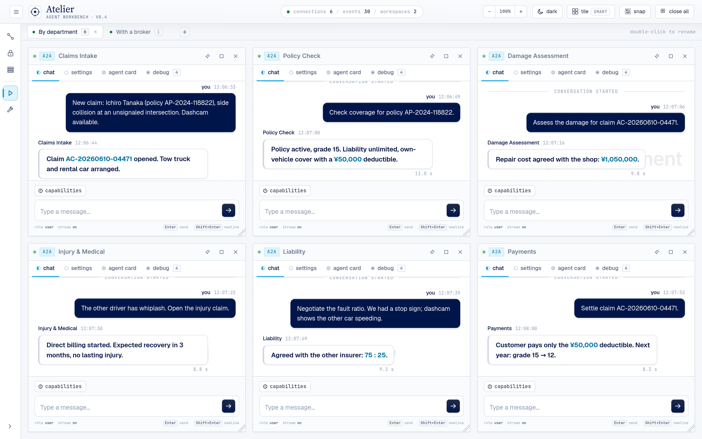
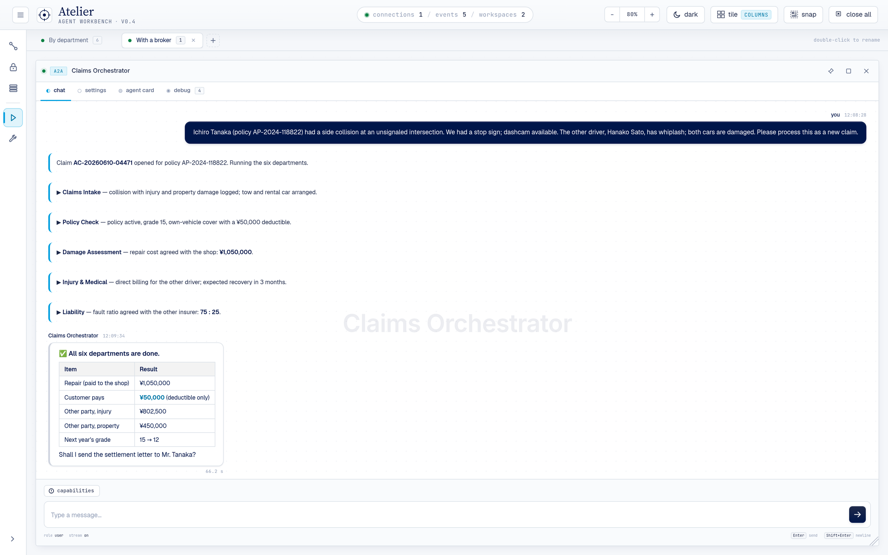
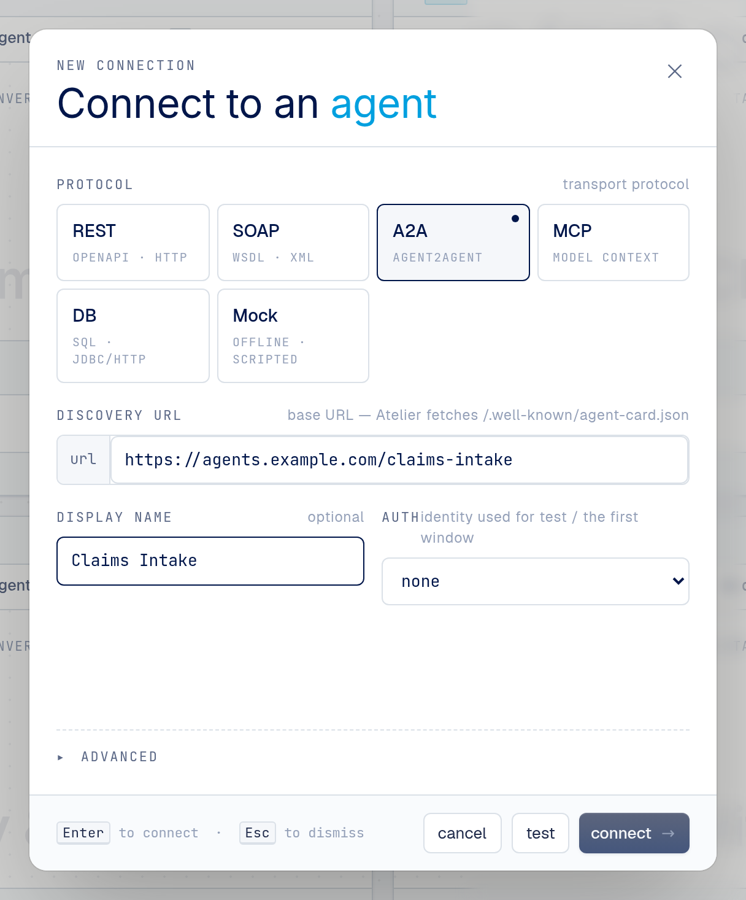

# Atelier — Agent Workbench

A browser workbench for talking to many agents at once. Open a floating window per
connection — **A2A**, **MCP**, **REST**, **SOAP** or **SQL** — and drive them side by side,
by hand or from a scripted scenario.



## Features

- **One window per connection.** Chat, the agent card, raw RPC frames and settings, each on a tab.
- **Workspaces.** Keep several sets of windows and switch between them with tabs.
- **Scenarios.** Write a conversation across agents as text and replay it. A mock mode
  replays scripted replies, so a demo needs no servers.
- **MCP for A2A agents.** Attach MCP servers to an A2A window; their tools travel with every message.
- **Anypoint integration.** Browse agents in Exchange and pick deployed apps from Runtime Manager.
- **No build step.** Plain ES modules and one `index.html`; the server only serves files and a CORS proxy.

| A broker runs the six departments from one request | Connect to any agent by URL |
|---|---|
|  |  |

## Quick start

```sh
node server/dev-server.js --port 8000      # or: python3 server/dev-server.py --port 8000
```

Open http://127.0.0.1:8000/ and click **+ new connection**.
To try the demo without any servers: **Import → Repository → 保険 — 自動車保険金請求**, then **▶ Run**.

## Deploy

`mule-app/` packages the UI into a Mule app for CloudHub 2.0 — see [mule-app/README.md](mule-app/README.md)
and the deploy flow in [ONBOARDING.md](ONBOARDING.md).

## Scenarios

`scenarios/` is the repository behind **Import → Repository**. The UI reads it straight from GitHub,
so a scenario pushed here appears without redeploying; a workflow regenerates `scenarios/index.json`.

## Security

Atelier is a demo and development tool. It keeps OAuth client secrets in the browser, and the
hosted `/proxy` has no authentication. Do not expose it to untrusted users.

## Documentation

| Document | What it covers |
|---|---|
| [docs/overview.ja.md](docs/overview.ja.md) | Full feature reference: protocols, MCP hand-off, DB workbench, scenario DSL, shortcuts (Japanese) |
| [docs/user-guide.md](docs/user-guide.md) | Step-by-step user guide (Japanese) |
| [docs/manual.md](docs/manual.md) | Operation manual (Japanese) |
| [docs/architecture.md](docs/architecture.md) | Architecture, state, data flow, adding a protocol adapter |
| [docs/scenario-mock-mode.md](docs/scenario-mock-mode.md) | How mock mode works |
| [ONBOARDING.md](ONBOARDING.md) | Local development, CloudHub 2.0 deploy, troubleshooting |
| [mule-app/README.md](mule-app/README.md) | The CloudHub 2.0 hosting app |

Demo video (Japanese, with captions): [docs/media/atelier-insurance-demo-2.5x.mp4](docs/media/atelier-insurance-demo-2.5x.mp4)
