# Atelier — Agent Workbench 操作マニュアル

Atelier は、**A2A / MCP / Slack / DB / Mock** など複数プロトコルのエージェントに *ひとつのワークベンチ* から接続し、**会話・デバッグ・メタデータ確認を複数ウィンドウで並行**して行うブラウザ UI です。

> 本マニュアルのスクリーンショットは headless Chrome で自動取得したものです（対象バージョン **v0.4**）。画面は接続状況やテーマにより多少異なります。

---

## 目次

1. [画面の構成](#1-画面の構成)
2. [エージェントに接続する（Connections）](#2-エージェントに接続するconnections)
3. [会話する（チャットウィンドウ）](#3-会話するチャットウィンドウ)
4. [ウィンドウの操作とワークスペース（Multi-window）](#4-ウィンドウの操作とワークスペースmulti-window)
5. [認証情報（Authentication）](#5-認証情報authentication)
6. [カタログ（Catalogs）](#6-カタログcatalogs)
7. [シナリオ / MOCK（Scenarios）](#7-シナリオ--mockscenarios)
8. [ツール（Tools）](#8-ツールtools)
9. [表示・テーマ・レール](#9-表示テーマレール)
10. [設定の書き出し・読み込み（Export / Import）](#10-設定の書き出し読み込みexport--import)
11. [付録：プロトコル早見表・ショートカット](#11-付録プロトコル早見表ショートカット)

---

## 1. 画面の構成

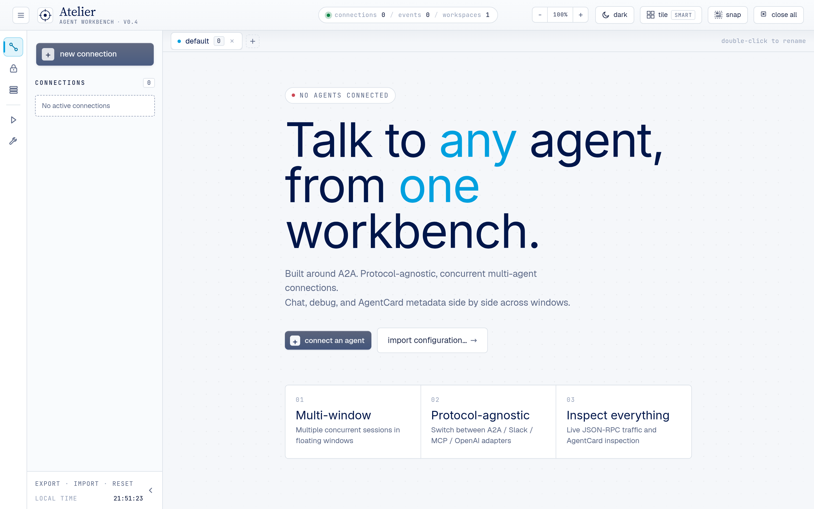

| 領域 | 内容 |
|------|------|
| **上部バー** | 左に `Atelier / AGENT WORKBENCH` ロゴ。中央に `connections / events / workspaces` の件数。右にズーム（`- 100% +`）、`dark`（テーマ切替）、`tile`（ウィンドウ整列）、`snap`（吸着）、`close all`（全ウィンドウを閉じる）。 |
| **左レール** | カテゴリのアイコン列。上から **Connections（接続）/ Authentication（認証）/ Catalogs（カタログ）**、区切り線、**Scenarios（シナリオ）/ Tools（ツール）**。カーソルを乗せると右に展開してラベルが出ます。 |
| **サイドパネル** | レールで選んだカテゴリの内容（一覧・追加ボタン）。 |
| **メインエリア** | ワークスペースのタブ（`default` など）と、開いたチャットウィンドウが並ぶ作業領域。未接続時はランディングが表示されます。 |
| **フッター** | `EXPORT · IMPORT · RESET` と `LOCAL TIME`。右端の `<` でサイドパネルを畳めます。 |

> **レールを畳む / 戻す**：フッター右端の `<` でサイドパネルを畳みます。畳むとレールだけが残り、**レール最下部の `»` ボタン**、またはレールのアイコンをクリックすると元に戻ります。

---

## 2. エージェントに接続する（Connections）

左上の **`+ new connection`**（またはランディングの `connect an agent`）で接続ダイアログを開きます。

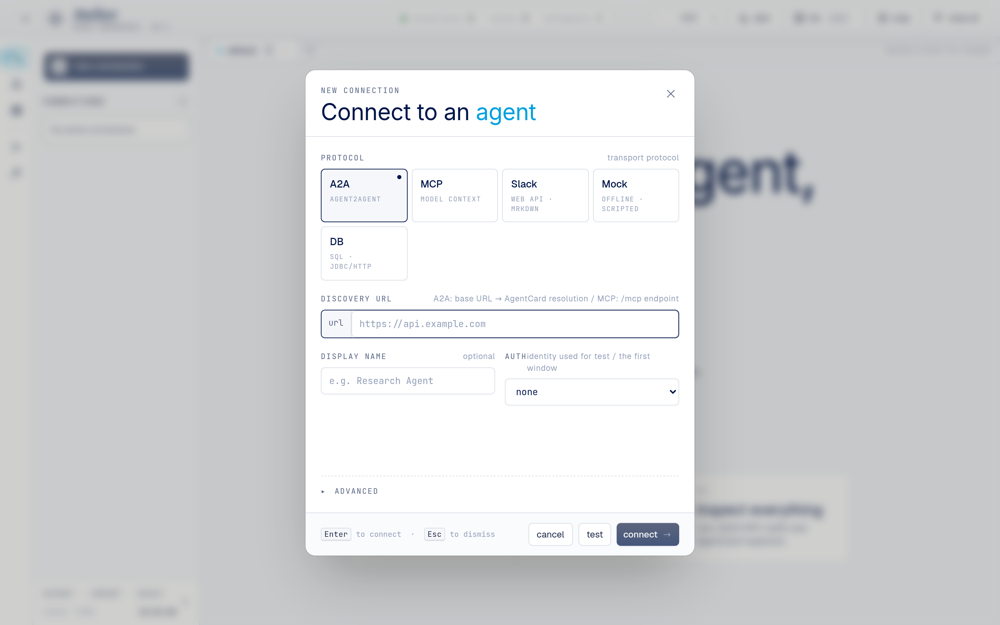

**手順**

1. **PROTOCOL** … 接続先の種類を選びます（**A2A / MCP / Slack / Mock / DB**）。
2. **DISCOVERY URL** … 接続先の URL を入力します。
   - A2A: ベース URL（`AgentCard` を自動解決）
   - MCP: `/mcp` エンドポイント
3. **DISPLAY NAME**（任意）… 一覧での表示名。
4. **AUTH**（任意）… テスト／最初のウィンドウで使う認証情報（[Authentication](#5-認証情報authentication) で登録したもの）。
5. **ADVANCED** … ヘッダーや追加設定（必要時）。
6. **`test`** で疎通を確認 → **`connect`** で接続。`Enter` でも接続、`Esc` で閉じます。

接続すると左の **CONNECTIONS** 一覧に追加され、各項目の **鉛筆アイコンで編集**、**クリックでぶら下がった詳細（ウィンドウ）を開けます**。

---

## 3. 会話する（チャットウィンドウ）

接続するとチャットウィンドウが開きます。ヘッダーにプロトコル種別（例：`A2A`）と接続名が表示され、`✧`（フロート）・`□`（最大化）・`×`（閉じる）で操作します。

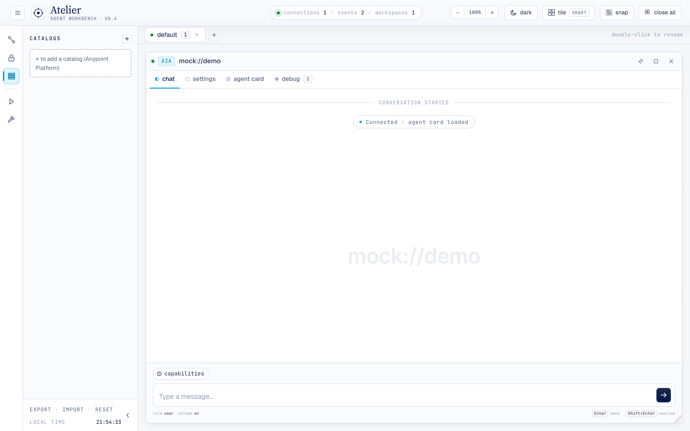

ウィンドウには **4つのタブ** があります。

### chat — 会話

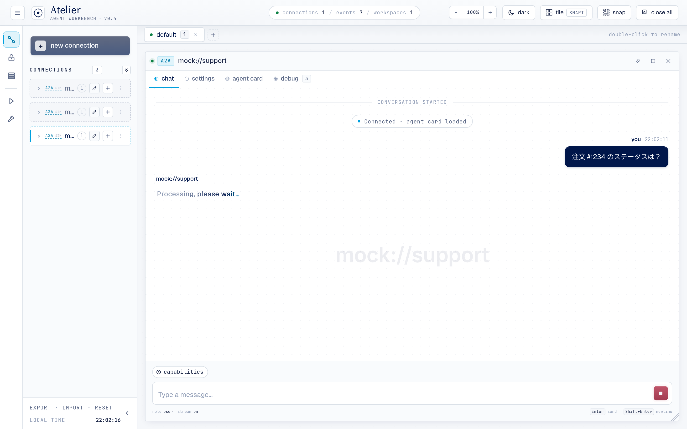

- 下部の入力欄にメッセージを入力し、**`Enter` で送信 / `Shift+Enter` で改行**。
- `role user` / `stream on` の切り替え、`capabilities`（相手の機能）確認が可能。
- 送信メッセージ・応答が時系列で並びます。

### agent card — メタデータ

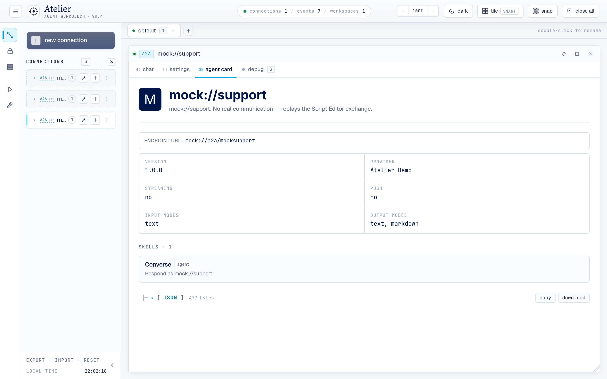

接続先の **AgentCard**（エンドポイント URL・バージョン・プロバイダ・ストリーミング/プッシュ対応・入出力モード・**スキル一覧**）を表示。右下の `copy` / `download` で生 JSON を取得できます。

### debug — 通信ログ

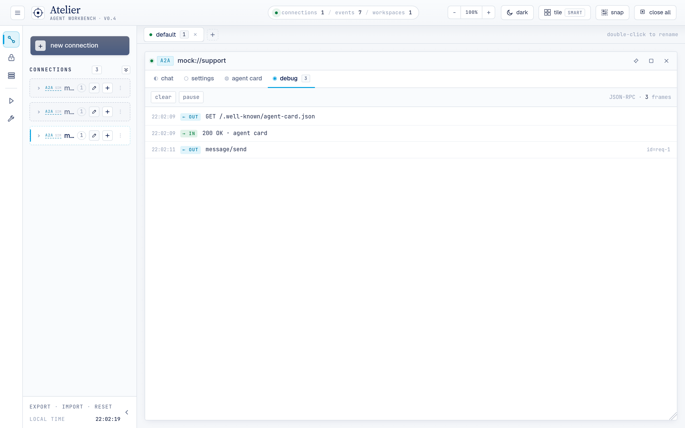

やり取りされた **JSON-RPC フレームをライブで確認** できます。タブのバッジ（例：`debug 3`）は捕捉フレーム数。一時停止・再開や、チャット内のクリアも可能です。

### settings — 接続設定

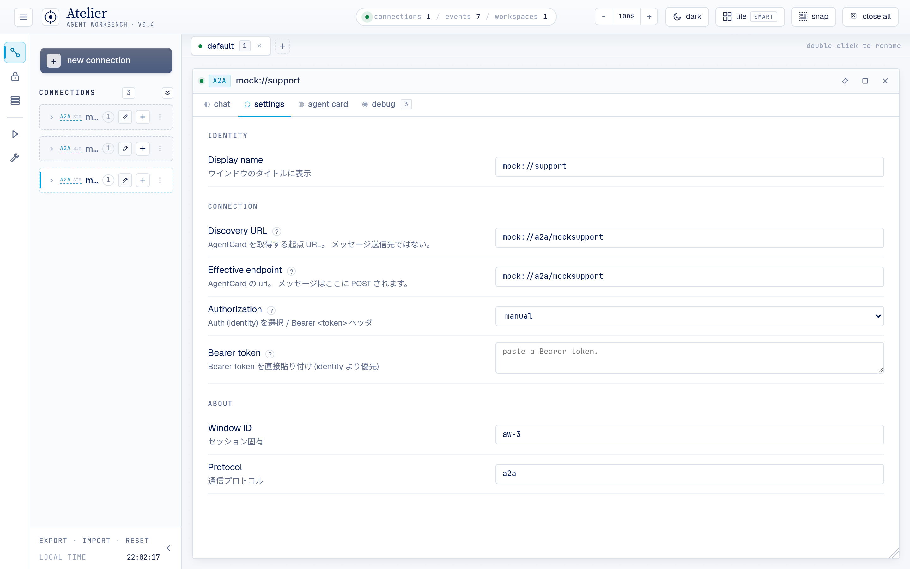

その接続のヘッダー・認証・ストリーミングなどの詳細設定を確認・変更します。

---

## 4. ウィンドウの操作とワークスペース（Multi-window）

Atelier の中心的な特徴が **複数エージェントの並行操作** です。

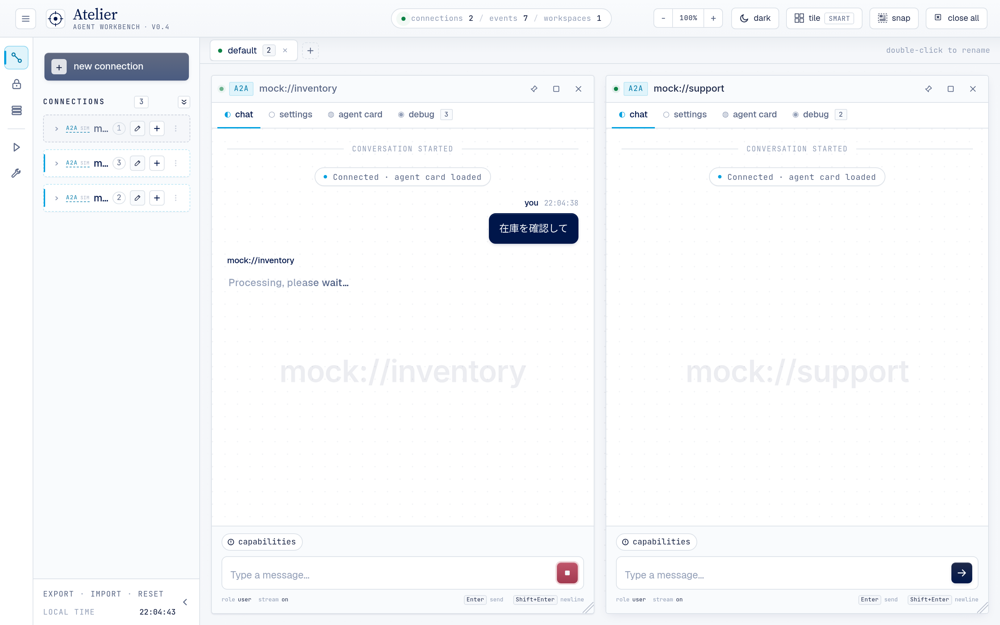

- **複数接続**：接続の数だけウィンドウを開けます。
- **`tile`（上部バー）**：開いているウィンドウを自動整列（`SMART` 配置）。
- **`snap`**：ドラッグ時にウィンドウを吸着させて整列。
- **ワークスペース**：`default` タブの横の `+` で作業セットを追加。タブを **ダブルクリックで rename**。用途ごとにウィンドウ群を分けられます。
- **`close all`**：全ウィンドウを一括で閉じます（確認ダイアログあり）。

---

## 5. 認証情報（Authentication）

レールの **Authentication** で、エージェント接続に使う **IdP クレデンシャル（identity）** を登録します。

`+` から identity を追加します。

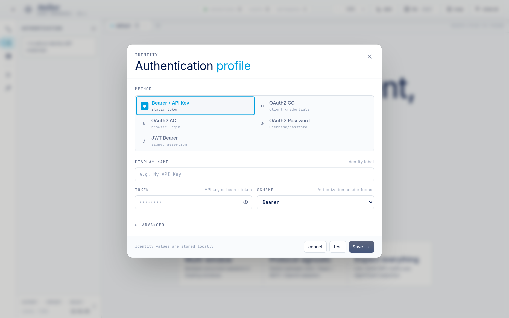

対応方式（例）：**Bearer / API Key**、**OAuth2 CC**（client credentials）、**OAuth2 AC**（ブラウザログイン）、**OAuth2 Password**、**JWT Bearer**。登録した identity は接続ダイアログの **AUTH** で選択できます。

---

## 6. カタログ（Catalogs）

レールの **Catalogs** で、**Anypoint Platform** のカタログ（API/エージェント資産）を登録します。

`+` からカタログを追加します。

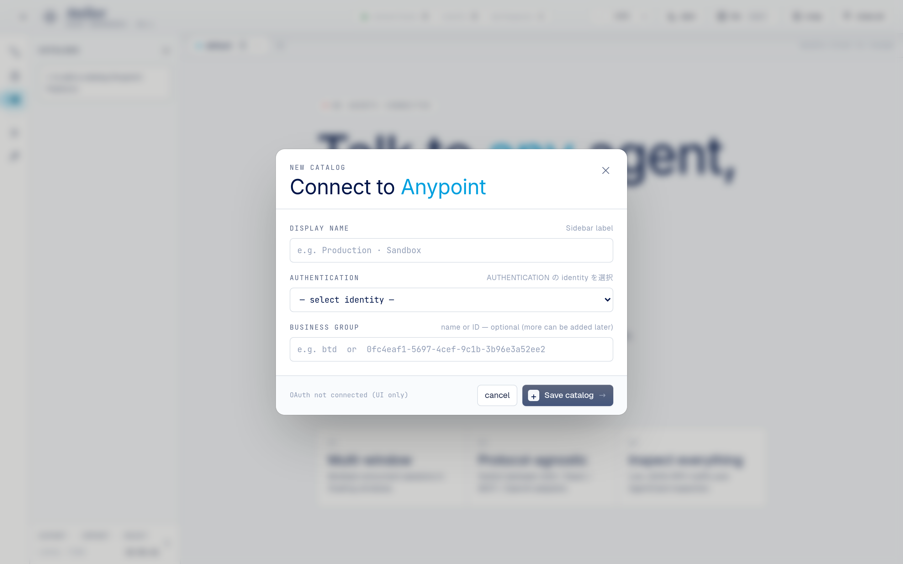

- 追加後、項目の **鉛筆アイコンで編集**、**クリックでぶら下がる business group のアコーディオンを展開** できます。
- 解決したエンドポイントはそのまま接続に利用できます。

---

## 7. シナリオ / MOCK（Scenarios）

レールの **Scenarios** で、**実サーバー無しで動く台本（スクリプト）** を管理します。デモや UI 確認に便利です。

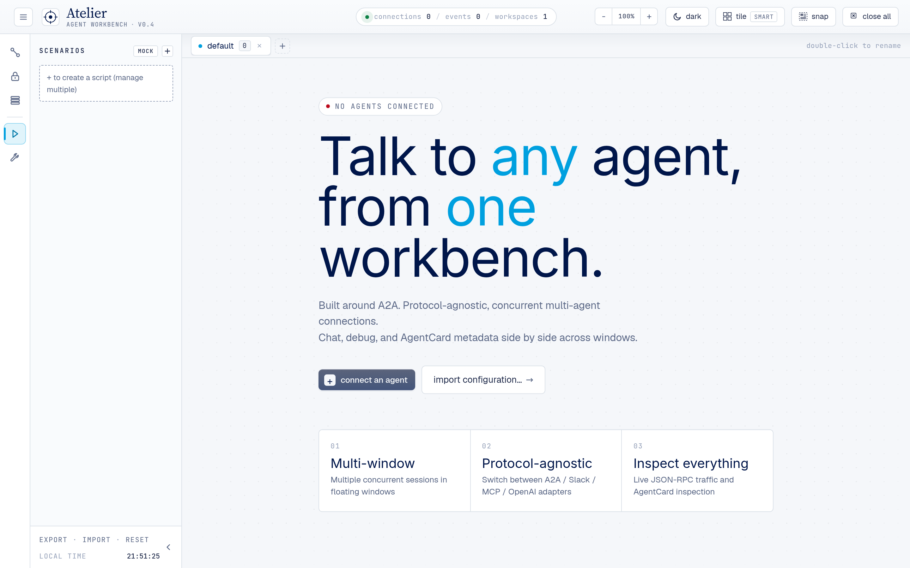

- **`+`** で新しいスクリプトを作成（複数管理可）。
- ヘッダーの **`MOCK`** トグルを ON にすると、**すべてのシナリオが MOCK モード**で動作します。
- 接続ダイアログで **`Mock`** プロトコルを選ぶと、実通信なしで台本が再生されます（オフライン・スクリプト再生）。

> このマニュアルの会話・debug のスクリーンショットも、この Mock 接続で取得しています。

---

## 8. ツール（Tools）

レールの **Tools** に、接続作業を助けるユーティリティがあります。

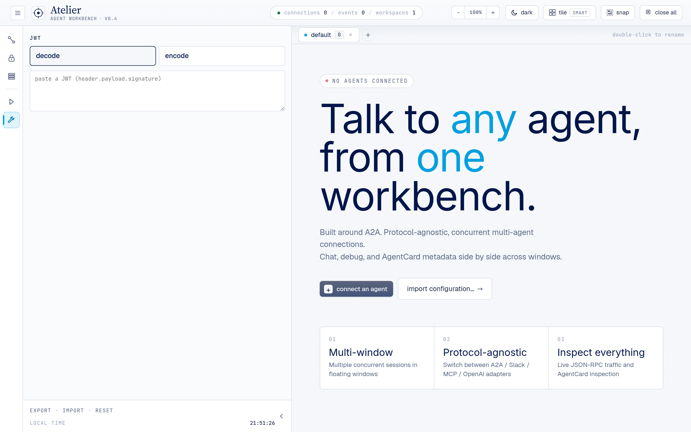

- **JWT デコーダー**：`decode` / `encode` を切り替えてトークンを検査・生成。`copy` でコピー。
- **暗号化**：`encode →` でテキストを暗号化（[Export/Import](#10-設定の書き出し読み込みexport--import) の passphrase と同じ仕組み）。

---

## 9. 表示・テーマ・レール

**ダークテーマ** … 上部バーの `dark` で切り替え。

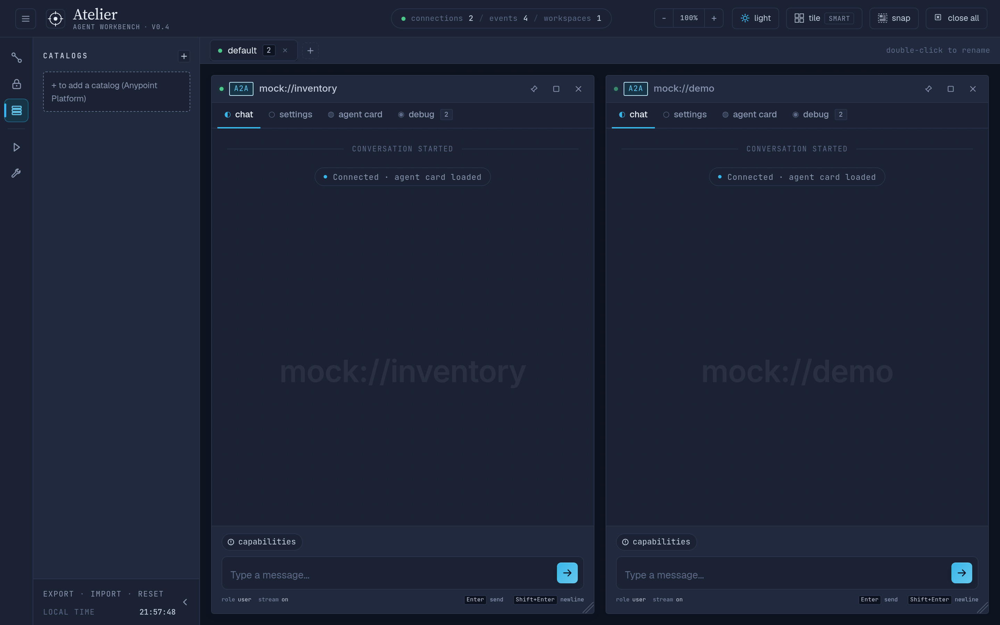

**レールのホバー展開** … レールにカーソルを乗せると右に開き、各カテゴリのラベルが表示されます。

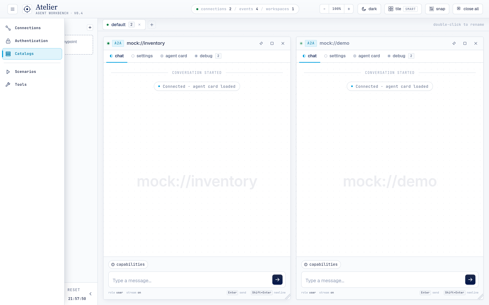

**サイドパネルの折り畳み** … フッター右端の `<` で畳むと、レールだけが残ります。**レール最下部の `»`** で元に戻せます。

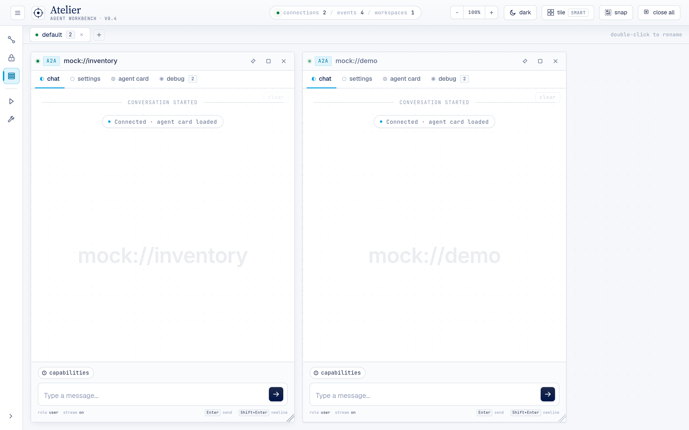

**ズーム** … 上部バーの `- 100% +` で全体の表示倍率を調整できます。

---

## 10. 設定の書き出し・読み込み（Export / Import）

フッターの **`EXPORT` / `IMPORT`** で、接続・カタログ・スクリプトなどの設定を JSON でやり取りします。

**Import**

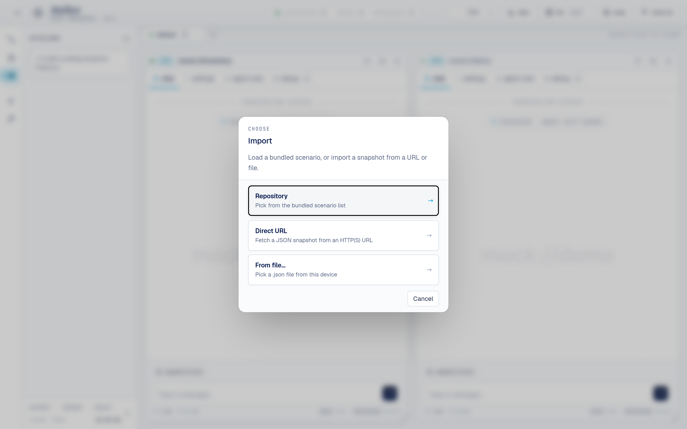

ファイルを読み込み、取り込む範囲（scope）を選択。暗号化ファイルは同じ **passphrase** で復号します。

**Export**

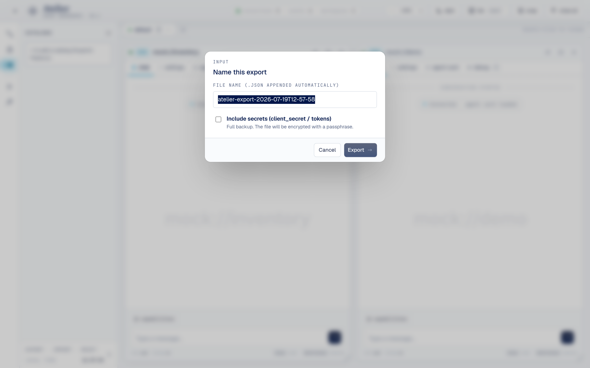

設定を JSON に書き出します。**Secret 込み**で出す場合は passphrase を指定して**ファイル全体を暗号化**できます。

> `RESET` は全設定（接続・カタログ・スクリプト・ワークスペース）の消去です。取り消せないため注意してください。

---

## 11. 付録：プロトコル早見表・ショートカット

### プロトコル早見表

| プロトコル | 用途 | Discovery URL の例 |
|-----------|------|--------------------|
| **A2A** | Agent2Agent 会話エージェント | ベース URL（AgentCard を自動解決） |
| **MCP** | Model Context Protocol ツールサーバ | `…/mcp` エンドポイント |
| **Slack** | Web API 経由のエージェント（Markdown） | Slack アプリのエンドポイント |
| **Mock** | オフライン・台本再生（デモ用） | `mock://…`（任意） |
| **DB** | SQL（JDBC/HTTP） | DB 接続先 |

### キーボードショートカット

| 操作 | キー |
|------|------|
| メッセージ送信 | `Enter` |
| 改行 | `Shift+Enter` |
| 接続ダイアログで接続 | `Enter` |
| ダイアログを閉じる | `Esc` |

---

*このマニュアルは Atelier v0.4 の UI をもとに自動生成しています。スクリーンショットは `docs/images/` にあります。*
