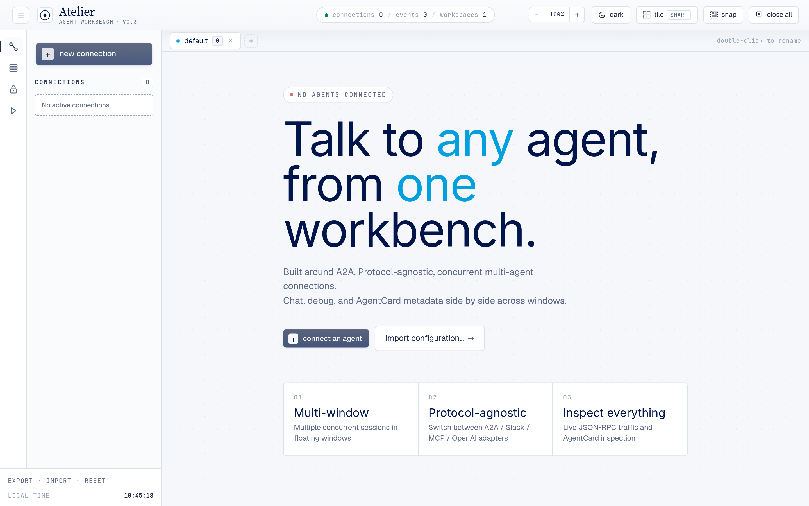
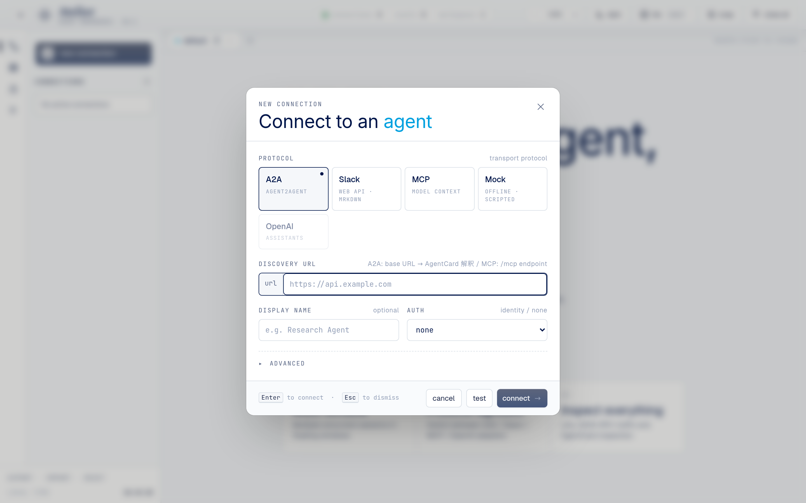
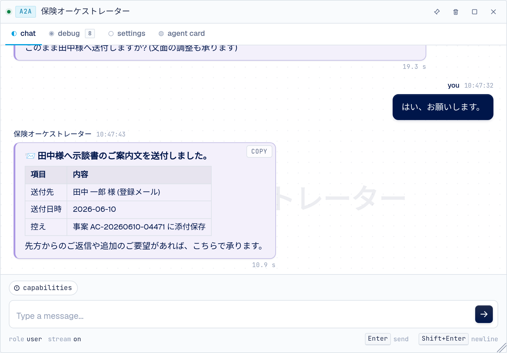
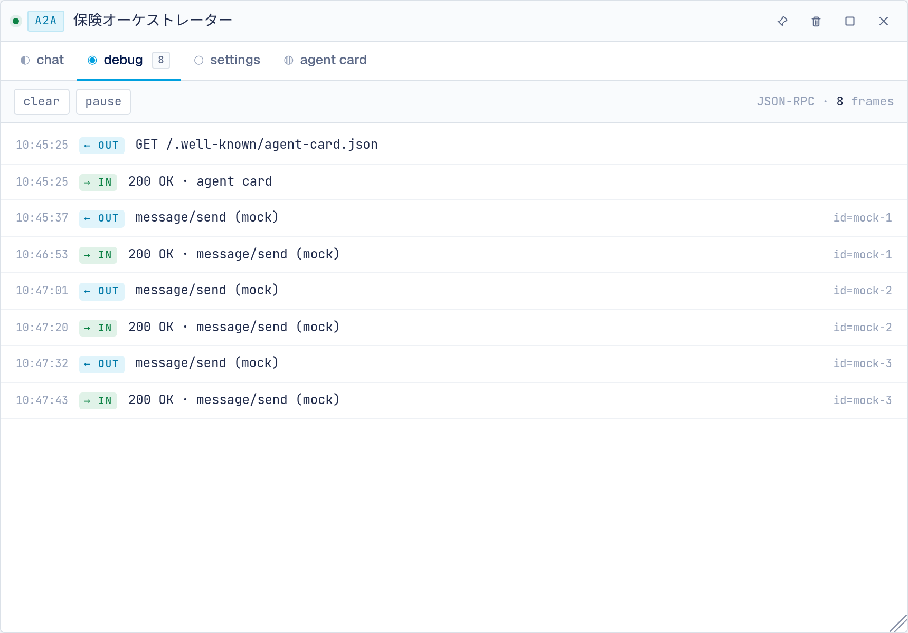
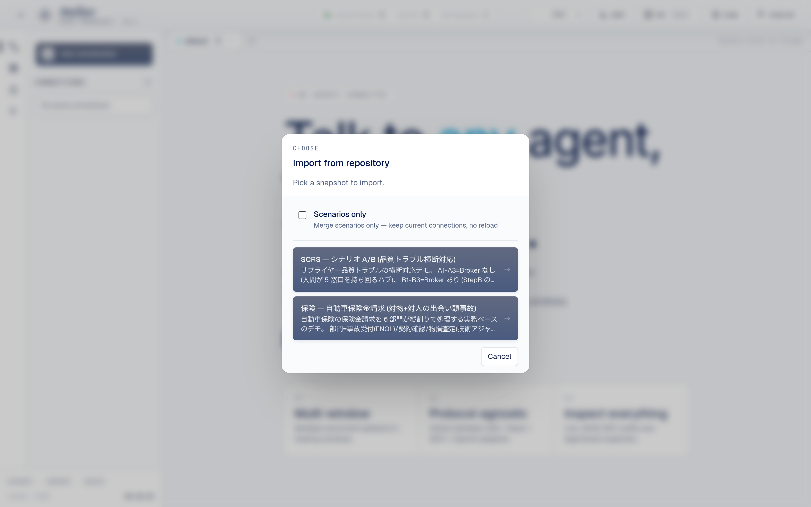
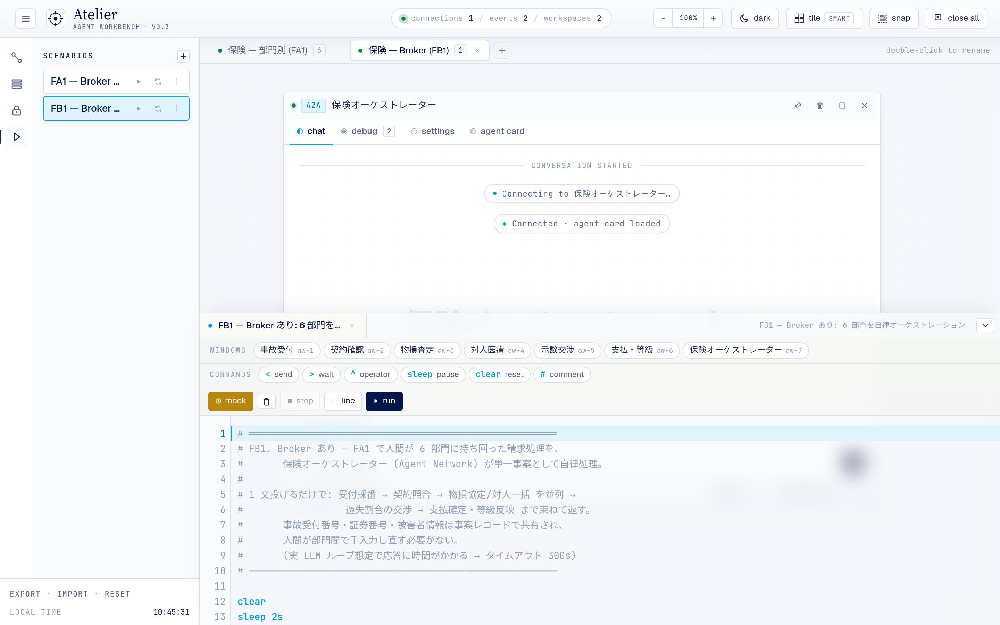

# Atelier 操作手順書（ユーザーガイド）

ブラウザだけで動く、A2A / MCP マルチエージェントの「作業台」。複数のエージェント窓を並べ、
台本（シナリオ）で会話を再生できます。本書は **画面の使い方** をまとめた操作手順書です。

- 概要・機能一覧 → [`README.md`](../README.md)
- 設計・データフロー → [`docs/architecture.md`](architecture.md)
- ローカル開発・CH2 デプロイ・ハマりどころ → [`ONBOARDING.md`](../ONBOARDING.md)



---

## 0. 起動

ES Modules を使うため `file://` 直開きでは動きません。dev サーバ経由で開きます。

```sh
node server/dev-server.js --port 8000
# → ブラウザで http://127.0.0.1:8000/
```

> CloudHub 2.0 にホストされた版（例: `https://atl2-23fgzd.pnwfdv.jpn-e1.cloudhub.io/`）は
> そのまま URL を開くだけで使えます。

---

## 1. 画面の構成


*↑ 保険シナリオを取り込んだ状態。中央に 6 部門のエージェント窓が並び、上部にワークスペースタブ（`保険 — 部門別 / 保険 — Broker`）が見えます。*

- **左サイドバー**：アイコンで `Connections / Catalogs / Authentication / Scripts` を切替
- **中央**：エージェント窓を自由に配置（ドラッグ移動・端をドラッグでリサイズ）
- **下部**：Script Panel（台本の編集・実行）
- **ワークスペース**：窓のセットを「作業空間」として複数持てる（上部バーのタブで切替）

---

## 2. エージェントに接続する（New Connection）

1. 左サイドバー **Connections** → **`+ new connection`** をクリック。
2. **protocol** を選ぶ：
   | プロトコル | 用途 |
   |---|---|
   | **A2A** | 会話するエージェント（チャット） |
   | **MCP** | ツールを呼ぶサーバ（tools タブでフォーム実行） |
   | **Slack** | Slack 互換 Web API |
   | **Mock** | 疑似エージェント（後述。実通信なし・デモ用） |
3. **URL** を入力（A2A は base URL でOK。Atelier が `/.well-known/agent-card.json` を自動取得）。
4. （任意）**display name** で表示名、**auth** で認証 identity を指定。
5. **test** で接続確認 → **connect** で窓が開く。



接続すると **Connections 一覧に登録**され、次回からはワンクリックで窓を開けます（接続＝ブックマーク）。
同じエージェントの窓を増やすには、一覧の行の **`+`** を押します。

### 窓のタブ
- **chat**：会話。下の入力欄にメッセージを打って送信（A2A は SSE ストリーミング表示）。
- **card**：AgentCard / MCP サーバ情報（能力・スキル一覧）。
- **debug**：生の RPC フレームを時系列表示。各フレームを開いて payload / headers を確認。
- **settings**：Discovery URL / 実エンドポイント / 認証 / プロトコル。表示名のインライン編集も。

| chat タブ | debug タブ |
|---|---|
|  |  |

---

## 3. Mock（疑似エージェント）を使う

実サーバが無くてもデモできる、**実通信しない疑似エージェント**です。
見た目・挙動は本物の A2A / MCP と同じで、UI 上は「mock」と出ません（一覧では破線＋`sim` バッジで区別）。

1. New Connection で **protocol = Mock** を選択。
2. **kind** で「装うプロトコル」を選ぶ：**A2A**（会話）/ **MCP**（ツールサーバ）。
3. URL 欄が **agent name** に変わるので、役割を表す名前（例：`事故受付`）を入れて connect。

mock 窓は、後述の台本（`$>` 行）の応答を再生するのに使います。チャットに直接打つと、その
エージェントの担当範囲を案内する定型応答が返ります（シナリオ同梱の mock の場合）。

---

## 4. シナリオ（台本）を読み込む — Import

配布済みのデモシナリオを取り込めます。

1. 上部バー / サイドバーの **Import** → **From remote site** → **Repository**。
2. 一覧から選ぶ：
   - **SCRS — シナリオ A/B**（製造業：品質トラブル横断対応）
   - **保険 — 自動車保険金請求**（保険：6部門の請求処理デモ）
3. **Scenarios only**（既定ON）= 台本だけ追加（接続は維持） / OFF = 接続・窓ごと丸ごと置換（リロード）。



> **From file…** でローカルの `.json` スナップショットも取り込めます（同じ「Import」ダイアログ）。

取り込むと、Scripts に台本が追加され、（everything 取込なら）窓とワークスペースも復元されます。

---

## 5. 台本を実行する — Script Panel

1. 左サイドバー **Scripts** → 台本を選ぶ（Script Panel が下からせり上がる）。
2. **▶ Run**（またはエディタにフォーカスして `⌘/Ctrl + Enter`）で実行。
3. 実行中、台本に沿って各窓へメッセージが送られ、応答が typewriter で流れます。



*↑ 保険シナリオの台本を開いた状態。参照する窓がすべて mock 接続なので **MOCK** が自動 ON（橙色）になっています。*

### MOCK モード（実通信なし・ローカル応答）
- 台本の `$>` 行に書いた応答をローカル再生する機能。**MOCK ボタン**で ON/OFF。
- **台本が参照する窓がすべて mock 接続なら、MOCK モードは自動 ON**（ボタン操作不要）。
  保険シナリオなど全 mock のデモは、Import → Run するだけで応答が流れます。

### 台本（DSL）の書き方
1 行 = 1 命令。エディタ下部の補完チップからも挿入できます。

| 記法 | 意味 |
|---|---|
| `< 窓名: メッセージ` | その窓へ送信（`${変数}` 展開可） |
| `> 窓名` / `> 窓名 30s` / `> 窓名 30s as 変数` | 応答待ち（タイムアウト指定・応答を変数に保存） |
| `$> 窓名: 応答` | mock 応答（送信と対称）。MOCK モード時に再生。改行は `\n` |
| `sleep 2s` | 一時停止 |
| `clear` / `clear 窓名` | 全窓 / 指定窓のチャットをクリア |
| `# コメント` | コメント行 |

**`$>` を続けて並べると順次表示**：同じ窓宛の `$>` を（間に他の行を挟まず）連続して書くと、
1 回の応答の中で**ステップを1つずつ順番に**表示します（1ステップ＝1行で書ける）。
間に `<` / `>` / `sleep` が入ると、次の送信用の応答として区切られます。

```
< 受付: 事故第一報を起票してください。
> 受付
$> 受付: 受付番号 AC-... を採番しました。
$> 受付: 損害サービスへ引き継ぎました。      # ← 上の行と続けて順次表示される
```

> 実行前に未オープンの窓は、登録済み接続（ブックマーク）から自動で開かれます。

---

## 6. ワークスペース（作業空間）

窓のセットを「作業空間」として複数持てます。上部バーのタブで切替。

- 保険シナリオなら **WS1=部門別6窓（FA1用）** / **WS2=Broker1窓（FB1用）** のように分かれています。
- タブの **`+`** で新規作成。

---

## 7. キーボードショートカット

`⌘`（macOS）/ `Ctrl`（Windows）。

| キー | 動作 |
|---|---|
| `⌘1`〜`⌘9` | N 番目の窓にフォーカス |
| `⌘⇧[` / `⌘⇧]` | ワークスペース切替（前 / 次） |
| `⌘⇧K` | Script Panel の開閉 |
| `⌘⏎`（エディタにフォーカス時） | 台本を実行 |
| `⌘.`（Script Panel 表示時） | 台本を停止 |
| `⌘W`（エディタにフォーカス時） | 現在の台本タブを閉じる |
| `Esc` | ダイアログ / メニューを閉じる |

> 「new connection」「new workspace」は対応する **`+` ボタン**から行います。

---

## 8. 設定の保存・バックアップ

- 接続・カタログ・台本・ワークスペースは **localStorage に自動保存**されます。
- **Export** で JSON スナップショットを書き出し、**Import** で復元・共有できます。
- **secrets（OAuth client_secret / token）は localStorage に保存されず、export にも含まれません**
  （sessionStorage に分離、タブを閉じると消えます）。
- **Reset** で全消去＆再読み込み。

---

## 9. デモの流れ（例：保険シナリオ）

1. **Import** → Repository → 「保険 — 自動車保険金請求」を選ぶ（everything で取込）。
2. **WS1（部門別6窓）** で台本 **FA1** を Run
   → Broker なしで、担当者が6部門を順に照会・3往復ずつ持ち回る「現状の手間」を再現。
3. **WS2（Broker1窓）** で台本 **FB1** を Run
   → 保険オーケストレーターに1文投げるだけで、6部門を順次処理→統合→お客様向け
   ご案内文の清書まで肩代わりする「Agent Network の価値」を提示。

全 mock 接続なので、実エンドポイント無しでそのまま再生できます（MOCK 自動 ON）。

### 操作の流れ（動画）

保険シナリオを Import したあと、**①まず Broker なし（FA1）** を部門別ワークスペースで実行して
「人が 6 部門をたらい回しする現状」を再現し、**②次に Broker あり（FB1）** を Broker ワークスペースで実行します。
②では先に **snap ボタン**で Broker 窓をワークスペース全面に広げてから実行しているので、
保険オーケストレーターが 6 部門を横断処理してお客様向けご案内文まで清書する様子が大きく見えます。

<video src="media/atelier-insurance-demo-2.5x.mp4" controls width="760" muted></video>

> 上の `<video>` がレンダリングされない環境（GitHub の Markdown プレビュー等）では、ファイルを直接開いてください：
> - [`docs/media/atelier-insurance-demo-2.5x.mp4`](media/atelier-insurance-demo-2.5x.mp4)（2.5 倍速・約 3 分 43 秒）
> - [`docs/media/atelier-insurance-demo.mp4`](media/atelier-insurance-demo.mp4)（等速・約 9 分 18 秒）

### 画面イメージ

| WS1：部門別 6 窓（FA1） | Broker の統合応答（FB1） |
|---|---|
|  |  |

---

## 困ったとき

| 症状 | 対処 |
|---|---|
| 窓が開かない / 接続失敗 | URL を確認。外部 A2A は CORS のため dev サーバの `/proxy` 経由が必要 |
| 台本の `$>` が流れない | MOCK モードが ON か確認（全 mock なら自動 ON）。窓名と `$>` の窓名が一致しているか |
| 応答が出ない | 窓が「接続済み（live）」か、`> 窓名` のタイムアウト内に応答が来ているか |
| 画面が古い | `⌘⇧R`（ハードリロード） |
